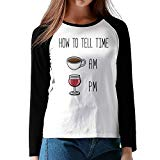
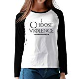

# Amazon-Apparel-Recommendation-system
Recommend similar apparel items/products in ecommerce.

## Business objective 
> Recommending similar apparel items to user.
Its estimated that amazon's 35% revenue is generated using product recommendations.

## Approach

We have two approaches here, 

1. Content based recommendation:
As its name suggests, we do content based recommendation, means its based on tittle text,Description text, images.

2. Collobarative filtering based recommendation:
This recommendations are done based on the behaviour of the user.A small example can be seen,

```
if    U1 ===> I1,I2 ,I3   (Purchases or Searches)   # U-User , I-Item
and   U2 ===> I1,I3,I4
then  U3 ===> I1,(I3)      # recommend user 3 item I3 as he purchased I1.
```

U3's recommendations came from behaviour of similar users as he purchased I1. This is Collobarative filtering.
But, Amazon doesnt provide users data, so we are not going to do collobarative filtering. Instead we use content based.

## Plan of Attack

These are the steps we follow during this project.
1. Data aquisition
2. Data Cleaning
3. Text Processing (NLP)

We solve this problem with both Text based and Image based.
4. Text based product recommendation
    - Bag of Words
    - Term frequency-Inverse document frequency (TF-IDF)
    - Word2Vec
      - Avg W2V
      - TF-IDF weighted W2V
  
5. Image based product recommendation
    - Using CNN deep learning techniques
6. A/B testing.

### 1. Data Aquisition:
We can use Amazon's Product Advertising API, and get the required data. We took womens tops as the dataset . It consists of 183000 datapoints, having 19 features each.
```
Index(['asin', 'author', 'availability', 'availability_type', 'brand', 'color',
       'editorial_reivew', 'editorial_review', 'formatted_price',
       'large_image_url', 'manufacturer', 'medium_image_url', 'model',
       'product_type_name', 'publisher', 'reviews', 'sku', 'small_image_url',
       'title'],
      dtype='object')
```
But we use only 6 features for this project.
1. asin  ( Amazon standard identification number)
2. brand ( brand to which the product belongs to )
3. color ( Color information of apparel, it can contain many colors as   a value ex: red and black stripes ) 
4. product_type_name (type of the apperal, ex: SHIRT/TSHIRT )
5. medium_image_url  ( url of the image )
6. title (title of the product.)
7. formatted_price (price of the product)

### 2. Data Cleaning

#### Basic Stats of every feature
For every feature we ask these questions
- How many missing values are present.
- Whats top frequent item, and how many times its repeating.
- We also see, top 10 most repeating words.

*As part of processing times and power, I just removed all the points that have missing datapoints in any feature.*
Just removed all the datapoints that have null value in feature columns **formatted_price** and **color**. after this we left with around 28000 datapoints.
If you see, we have a feature named **medium_image_url** this is url for our apparel image of medium size. Uisng Python Imaging Library (PIL) got all those images and saved them.

#### Remove near duplicate items
If we observe the feature **title**, there are many similar duplicate texts only varying in colors or sizes in its title like,
```
25. tokidoki The Queen of Diamonds Women's Shirt X-Large
26. tokidoki The Queen of Diamonds Women's Shirt Small
27. tokidoki The Queen of Diamonds Women's Shirt Large

75004.  EVALY Women's Cool University Of UTAH 3/4 Sleeve Raglan Tee
109225. EVALY Women's Unique University Of UTAH 3/4 Sleeve Raglan Tees
120832. EVALY Women's New University Of UTAH 3/4-Sleeve Raglan Tshirt
```
So we remove these duplicates, by comparing words in the title, we also remove title that contains less than 5 words.
After removing all these duplicates we have our dataset around 16000 datapoints.

### 3. Text Preprocessing
Basic text preprocessing steps like stopwords removal,spaces, alpha numeric characters removal and lowering the aplhabet cases.

### 4. Text Based Product Recommendation

We use only feature title to recommend apparels. In the next part used images for recommendation, we also combine both title and images for recommendation.
The main concept in this text based is we convert title text into vectors and find closest vectors to it using equilidean distance. The more closer the both vectors the most similar it is.
so to convert text into vectors, we use

**1. Bag of words**

**2. TF-IDF**

**3. Word2Vec**

This Word2Vec also considers semantics and sequence of data.

**A detailed description of all these concepts was shown in my [kaggle kernel](https://www.kaggle.com/shashanksai/text-preprocessing-using-python)**

### 5. Image based Product Recommendation

Using Transfer learning (means using already processed algorithm on some other data), we use VGG 16 algorithm to convert images data into vectors. 

All these outputs, results can be seen in Ipynb file.

### 6. A/B testing
This is like performance metric to evaluate our model in production, so here i'm gonna give an overview about it.

if we build two models, we split the users into 2 categories named A and B. we deploy both models on both categories and compare the resutls and decide the better model.


### Results/Output

**Query Image**
<p align="center">
  
</p>

**Recommended Apparels**





### Reloaded


